<p align="center">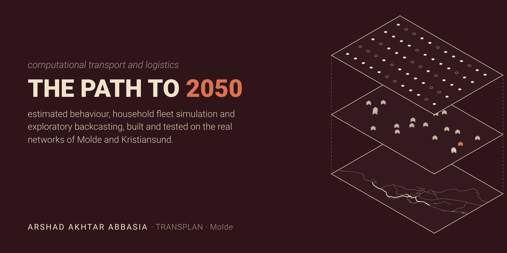</p>

# Robust and acceptable pathways to low-emission regional mobility

[](https://github.com/Astheno-sphere/computational_Logistics/actions/workflows/tests.yml)

**Arshad Akhtar Abbasia** · Reproducible research prototype for a proposed PhD in Logistics at Molde
University College, within TRANSPLAN (Norwegian Centre for Sustainable Transport Planning) ·
Case studies: Molde and Kristiansund, Norway

> **Research question.** How much confidence does a 2050 transport pathway deserve when the behaviour
> behind it is estimated with error and the future itself is deeply uncertain, and which policies stay
> effective, acceptable and affordable anyway?

Norway won the showroom: in 2025 almost every new car sold was electric. Most cars on the road still
burn fuel, the fleet renews slowly, and the tax base that came from fuel is draining away. The next
decisions are about road pricing, fleet turnover and plans that must reach 2050 targets nobody can
forecast. This repository is the engine I am building for that question, and it already runs end to end.

**Read:** [Proposal, five pages](https://astheno-sphere.github.io/computational_Logistics/proposal/proposal-5p.html) · [Long read](https://astheno-sphere.github.io/computational_Logistics/proposal/proposal5.html) · [Portfolio](https://astheno-sphere.github.io/computational_Logistics/proposal/standalone.html) ·
[How it works](#the-engine) · [What runs, what is planned](#status) · [Reproduce](#reproduce) ·
[Tools and gaps](#tools-and-gaps) · [Limitations](#limitations) · [Supporting toolkit](#supporting-toolkit)

## The engine

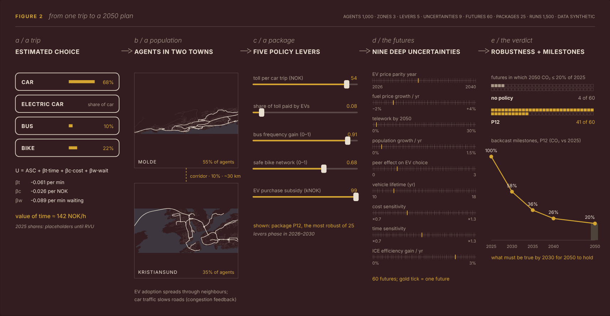

Estimated travel preferences (a discrete choice model) drive commuters in an agent-based model. The
model runs across many futures and many policy packages, and each package is judged by the share of
futures in which it reaches the 2050 target. Packages must also be acceptable and affordable. The
successful futures are read backwards into milestones and a 2030 signpost. This extends the coupling of
choice models and agent models used for policy acceptability in urban freight (Le Pira, Marcucci,
Gatta et al., 2017) to long-horizon passenger policy under deep uncertainty, as an exploratory layer
alongside the national models NTM6 and RTM.

| What the prototype shows | Figure |
|---|---|
| In 19 of 60 futures no package works; the most robust package works in every other one | [data tree](docs/figures/data-tree.png) |
| Robustness has a price: the best self-financing package gives up 4 of 60 futures | [price of robustness](docs/figures/price-of-robustness.png) |
| Long-lived cars and little telework sink every package, and a 2030 reading flags 17 of 19 failures | [failure box and signpost](docs/figures/failure-and-signpost.png) |

These numbers come from synthetic behaviour and illustrative parameters. They show that the chain
works, not what will happen in Norway.

## Status

| Article | Question | Module | Today | What the PhD adds |
|---|---|---|---|---|
| A1 | How do people trade off time, cost and vehicle technology, and which packages would they accept? | [`dcm-estimate`](skills/dcm-estimate/SKILL.md) | runs, tested on synthetic choices (recovery test: all parameters within one standard error) | stated-choice survey in both towns, mixed and latent-class logit, an estimated acceptance model |
| A2 | Can estimated behaviour drive an agent model that stays consistent and can be validated? | [`abm-transport`](skills/abm-transport/SKILL.md) | runs, tested; fleet turnover, EV diffusion, welfare per agent, public money | calibration to RVU and SSB, car vintages per household, Kristiansund transfer test, a 2010 to 2025 historical check |
| A3 | Which packages stay robust, acceptable and affordable, and what makes them fail? | [`dmdu-explore`](skills/dmdu-explore/SKILL.md) | runs, tested; 60 futures × 25 packages, robustness, PRIM, backcast milestones | about 10⁴ futures, regret and Sobol, consistent futures, 2026 policy instruments, freight transfer |
| A4 (optional) | What must hold by 2030, and which signposts warn early? | `dmdu-explore.backcast` | milestones and one signpost computed | adaptive pathways and a workshop with planners |
| Case | Where do networks concentrate travel? | [`osm-network`](skills/osm-network/SKILL.md), [`vrp-solve`](skills/vrp-solve/SKILL.md), [`visual-narrative`](skills/visual-narrative/SKILL.md) | real OpenStreetMap networks for both towns, four plates | agents routed on the network |

## Reproduce

```bash
pip install -r requirements.txt        # exact versions used: requirements-lock.txt
python -m pytest -q tests              # the suite CI runs on every push
python examples/transplan_study.py     # choice model, ensemble, robustness, backcast
python docs/proposal/make_data.py      # re-runs the 1,500 runs behind the proposal figures
python docs/proposal/make_towns.py     # route shares on both OSM networks (extracts: data/osm/README.md)
python docs/proposal/build.py && python docs/proposal/build_standalone.py
```

## Tools and gaps

| Have | Missing, and when it comes |
|---|---|
| Discrete choice estimation with two independent estimators | Mixed and latent-class logit, survey design (A1) |
| Agent model with EV diffusion, fleet turnover, welfare and public money | Car vintages per household, distribution by zone and income (A2) |
| Ensembles, robustness, PRIM, backcast milestones | Regret, Sobol, consistent futures, surrogate model (A3) |
| Real road networks, route shares, vehicle routing, facility location | Agents routed on the network (A2) |
| Figures rebuilt from code, 87 tests in CI | A versioned data release with a DOI |

## Limitations

- All behaviour is synthetic until the A1 survey; parameters are illustrative.
- The policy levers in the prototype include instruments Norway is now phasing out (EV purchase support,
  EV toll exemption). The PhD tests the 2026 instruments: distance-based road charging, toll rings that
  EVs pay, public transport frequency, cycling infrastructure and fleet renewal.
- Agents carry trip lengths, not routes; congestion is zonal.
- Sixty futures demonstrate the method; they are not an analysis.

---

## Supporting toolkit

The research engine sits inside a wider toolkit I built for computational transport and logistics work.
It shows how I work; it is not part of the research argument.

**Asthenosphere.** The asthenosphere is the slowly flowing layer beneath the Earth's rigid crust. Cities
have one too: the flows of people, vehicles and goods beneath their visible form.

**Browse:** [Research atlas](https://astheno-sphere.github.io/computational_Logistics/) ·
[System](#the-system-and-the-thesis) · [Agent tiers](#hybrid-agent-tiers) · [Theory funnel](#theory-funnel) ·
[Toolkit](#toolkit) · [Framework](docs/FRAMEWORK.md) · [References](docs/REFERENCES.md) ·
[Knowledge bank](knowledge-bank/README.md) (index only; the sources are rebuilt locally)

### Molde in four plates

Every result in this repository is told the same way: one idea per plate, the method written as
something you could do, one highlighted instance of it, and every number computed by the script that
drew it. Real OpenStreetMap data for Molde; the plates come from the
[`visual-narrative`](skills/visual-narrative/SKILL.md) skill and run on the same road graph as the
routing skills ([gallery and how to rebuild](docs/plates/README.md)).

<table>
<tr>
<td width="50%"><a href="docs/plates/01-freight-pinch-points.png">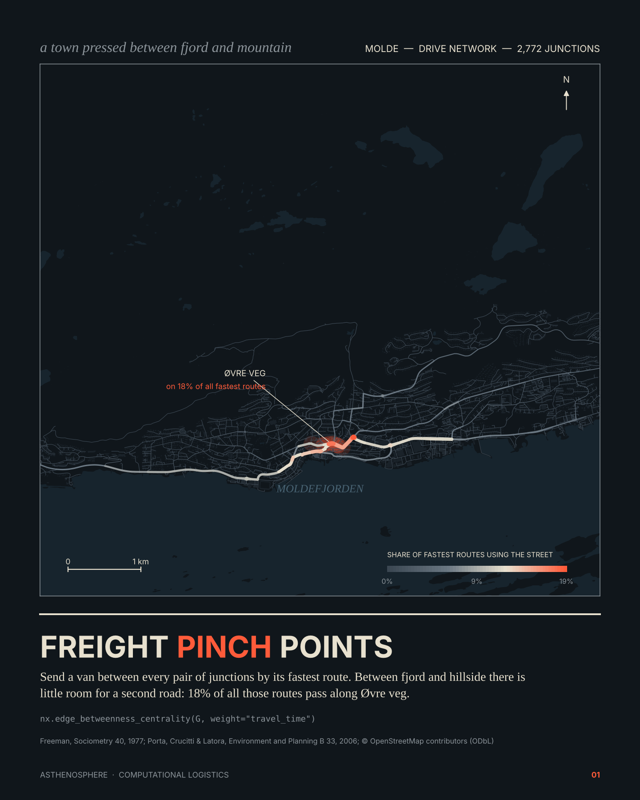</a></td>
<td width="50%"><a href="docs/plates/02-where-the-detour-goes.png">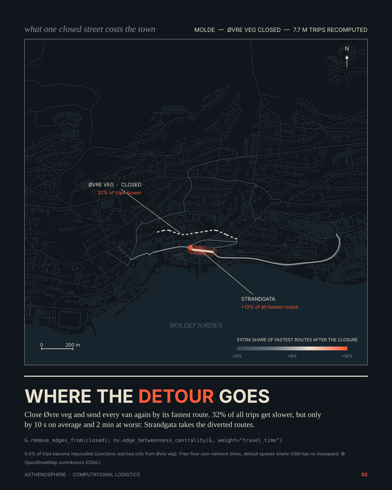</a></td>
</tr>
<tr>
<td><b>01 · Freight pinch points.</b> Route every pair of junctions; between fjord and hillside, 18% of all fastest routes pass along one street. <i>Network centrality.</i></td>
<td><b>02 · Where the detour goes.</b> Close that street and re-route 7.7 million trips: a third get slower, by seconds, and the shore road takes the load. <i>Resilience scenario.</i></td>
</tr>
<tr>
<td><a href="docs/plates/03-the-five-minute-depot.png">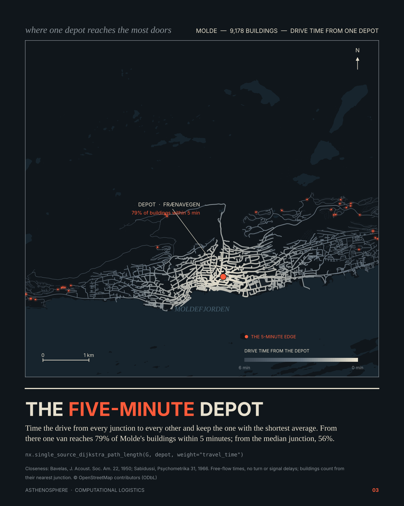</a></td>
<td><a href="docs/plates/04-the-shortest-loop.png">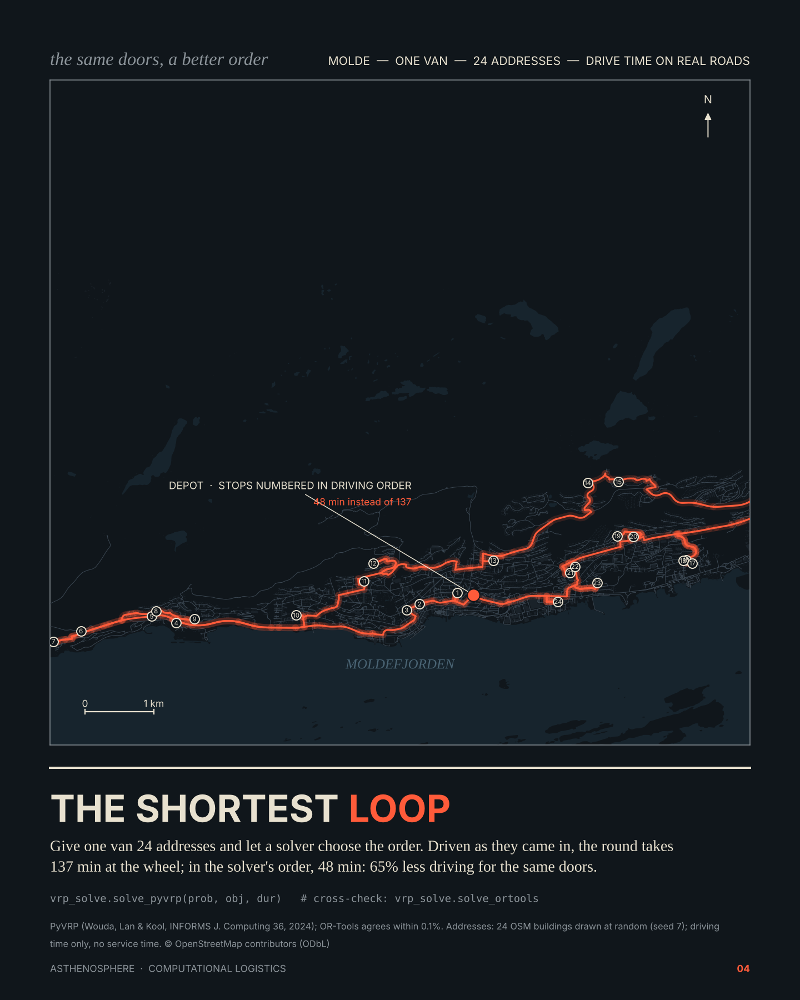</a></td>
</tr>
<tr>
<td><b>03 · The five-minute depot.</b> The junction with the shortest average drive reaches 79% of buildings in five minutes; the median junction, 56%. <i>Facility location.</i></td>
<td><b>04 · The shortest loop.</b> One van, 24 addresses: 48 minutes of driving in the solver's order against 137 as received. <i>Vehicle routing, two solvers.</i></td>
</tr>
</table>

---

### What this is

Asthenosphere assembles the pieces a transport and logistics planner needs into one coherent toolkit:

- **Skills**: tested, documented modules for discrete choice estimation, agent-based simulation,
  scenario analysis under deep uncertainty, road networks, vehicle routing, optimisation and
  Grasshopper data trees.
- **Agents and protocols**: the skills are a Claude Code plugin, an MCP server any agent host can use,
  and Grasshopper components through Hops, all over one shared core.
- **Design and storytelling**: connections to Rhino, Grasshopper and GIS, following the parametric and
  environmental toolkit used in computational design practice, so results become drawings, maps and
  narratives.
- **Knowledge bank**: about 280 license-checked open-source references (code, books, MCP servers)
  catalogued so new skills are built on real, current APIs.

It works for any city or region: networks are built from OpenStreetMap by place name or file, in the
local projected coordinate system. Molde and Kristiansund are the test case.

### The system and the thesis

<p align="center">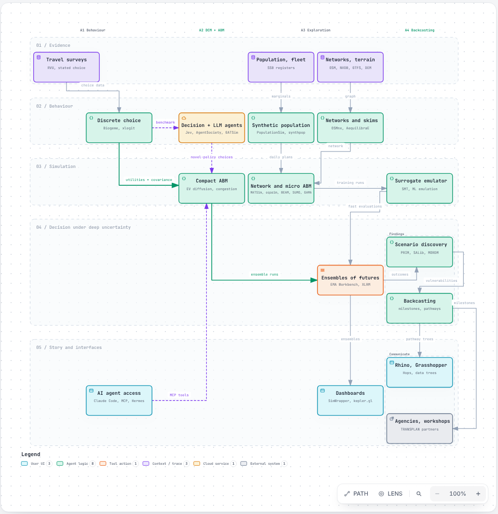</p>

Five lanes across the four thesis articles (A1 behaviour, A2 coupled DCM and ABM, A3 exploration,
A4 backcasting). Estimated choice models drive the agents. Decision models (Jev) and LLM agents
(AgentSociety, GATSim, LLM agents in GAMA) stress-test them on policies the surveys never covered.
Network ABMs (MATSim, eqasim, BEAM, SUMO, GAMA) train surrogates, so thousands of futures stay
affordable. Results reach agencies as dashboards and as Grasshopper data trees. The diagram is typed
JSON checked by [Archify](https://github.com/tt-a1i/archify); anyone can edit it and re-run the
checks ([how](docs/diagrams/README.md)). The interactive version (pan, zoom, trace paths) is on the
[research atlas](https://astheno-sphere.github.io/computational_Logistics/).

### Hybrid agent tiers

<p align="center">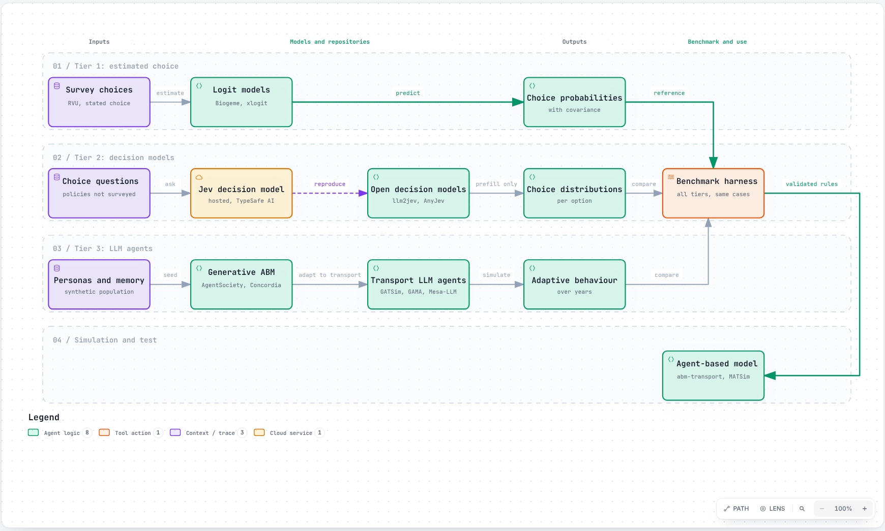</p>

Tier 1, estimated logit, drives most agents. Tier 2 decision models (Jev; open versions llm2jev,
AnyJev, Open-Jev) answer choices the survey never asked, as probabilities that can be compared with
the logit. Tier 3 LLM agents (AgentSociety, Concordia, OASIS, GATSim, LLM agents in GAMA, Mesa-LLM)
probe how behaviour adapts over years. All of these repositories are cloned into the knowledge bank.
[Interactive version](docs/diagrams/workflow-agent-tiers-20261007/agent-tiers.html).

### Theory funnel

<p align="center">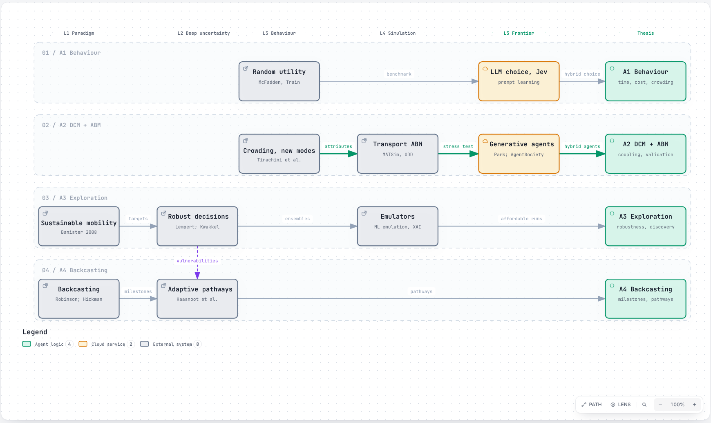</p>

Paradigms (sustainable mobility, backcasting) narrow through decision theory under deep uncertainty,
random utility and new-mobility research (Tirachini and co-authors on crowding, ride-hailing and
automated transit), agent-based simulation, and the LLM frontier, to the four articles. Entries with
what each gives the thesis: [`docs/THEORY.md`](docs/THEORY.md); BibTeX: [`docs/references.bib`](docs/references.bib).

### God's-eye view

<p align="center">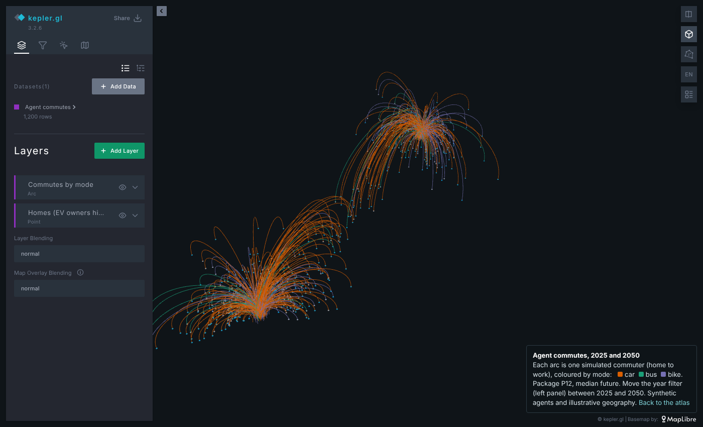</p>

One ensemble, three views, generated by [`viz-story`](skills/viz-story/SKILL.md):

| View | For | Open |
|---|---|---|
| kepler.gl agent flows: each commuter's home-to-work arc by mode, 2025 vs 2050 | public, decision makers | [map](https://astheno-sphere.github.io/computational_Logistics/story/kepler/agent-flows.html) |
| SimWrapper dashboard: CO2 pathway bands per package, robustness, mode shares, futures | modellers | [simwrapper.app](https://simwrapper.app/github/Astheno-sphere/computational_Logistics/docs/story/simwrapper) · [files](docs/story/simwrapper) |
| Grasshopper pathway explorer: pathways as a `{future}` data tree through Hops, a slider per future | planners, designers | [script](skills/viz-story/grasshopper/pathway_explorer.py), Hops `/cl/pathways` |

### Toolchain and protocols

<p align="center">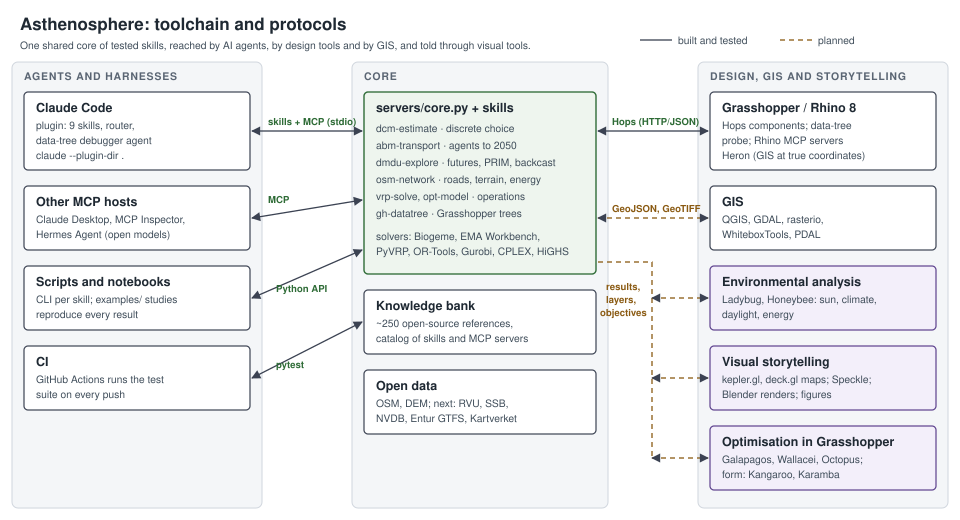</p>

| Protocol | Between | Status |
|---|---|---|
| Claude Code plugin (`.claude-plugin/`, `skills/`, `agents/`) | Claude Code ↔ skills | built |
| MCP over stdio (`servers/mcp_server.py`, `.mcp.json`) | any MCP host ↔ core | built, tested as a subprocess |
| Hops, HTTP/JSON (`servers/hops_app.py`) | Grasshopper ↔ core; routes as Rhino points, plans as data trees | built, tested with Grasshopper's payloads |
| Rhino MCP | agents ↔ live Rhino model (open servers in the bank) | used by the data-tree debugger |
| Files: GraphML, GeoJSON, GeoTIFF, CSV, LP/MPS/NL | core ↔ GIS, solvers, other tools | GraphML and solver formats built; GIS export planned |
| CI (GitHub Actions) | every push ↔ test suite | built |

### Toolkit

| Layer | Skill / component | What it gives you | Status |
|---|---|---|---|
| Behaviour | [`dcm-estimate`](skills/dcm-estimate/SKILL.md) | Multinomial logit with Biogeme, cross-checked by an independent estimator; value of time; parameter uncertainty | tested |
| Simulation | [`abm-transport`](skills/abm-transport/SKILL.md) | Agents to 2050: EV adoption with peer effects, mode choice from estimated utilities, congestion feedback, policy levers | tested |
| Decision | [`dmdu-explore`](skills/dmdu-explore/SKILL.md) | EMA Workbench ensembles, robustness, PRIM scenario discovery, backcasting to milestones | tested |
| Networks | [`osm-network`](skills/osm-network/SKILL.md) | Road graph for any place, terrain grades, travel time, EV energy, least-energy routing | tested |
| Operations | [`vrp-solve`](skills/vrp-solve/SKILL.md) · [`opt-model`](skills/opt-model/SKILL.md) | Vehicle routing (PyVRP, OR-Tools); AMPL-style LP/MIP with Gurobi, CPLEX or HiGHS | tested |
| Design | [`gh-datatree`](skills/gh-datatree/SKILL.md) · [agent](agents/gh-datatree-debugger.md) | Grasshopper data-tree model, live probe, diagnoser and debugging agent | model tested; live Rhino run pending |
| Story | [`viz-story`](skills/viz-story/SKILL.md) | SimWrapper dashboard, kepler.gl agent-flow map, Grasshopper pathway explorer from one ensemble | tested |
| Plates | [`visual-narrative`](skills/visual-narrative/SKILL.md) | House style for every figure: one idea per plate, concept as a procedure, one highlighted instance, cited and reproducible ([4 Molde plates](docs/plates/README.md)) | built |
| Routing | [`cl-foundations`](skills/cl-foundations/SKILL.md) | Router: sends each request to the right skill; shared conventions | built |
| Interfaces | [`servers/`](servers/) | MCP server and Hops app over a shared core | tested |
| Knowledge | [`knowledge-bank/`](knowledge-bank/README.md) | Vendored open-source code and books with licenses, searchable catalog, sync and harvest tools | curated |

### Design and storytelling toolkit

Computational design practice tells its stories through Rhino, Grasshopper and their plugins. The table
counts how often each tool appears across the open AEC skill collections indexed in the knowledge bank.
Asthenosphere connects its
results to the same tools so that a robust policy pathway becomes a map, a model and a narrative.

| Tool | Used for | Mentions in his skills | In our bank |
|---|---|---|---|
| Ladybug, Honeybee | climate, sun, daylight and energy analysis; environmental graphics | 29, 21 | yes (AGPL, isolated) |
| Dynamo | Revit automation | 31 | not yet |
| Karamba3D | structural analysis in Grasshopper | 22 | no (commercial) |
| Kangaroo | physics-based form finding | 20 | no (ships with Rhino) |
| Galapagos, Wallacei, Octopus, Opossum | single- and multi-objective optimisation in Grasshopper | 17, 9, 10, 11 | no (Galapagos is built in; others are free plugins) |
| Speckle | data exchange between design tools | 16 | yes |
| Rhino.Inside | Rhino and Grasshopper inside Revit and other hosts | 12 | yes (Revit) |
| Blender | rendering and animation for storytelling | 11 | Blender MCP server, yes |
| QGIS, Heron, Elk | GIS and OpenStreetMap into Rhino at true coordinates | 9, 8, 6 | QGIS and Heron yes |
| IfcOpenShell | BIM/IFC data | 9 | yes |
| Hops, Rhino Compute | Python and remote solvers as Grasshopper components | 8 | yes, and our Hops app uses it |
| COMPAS | computational design framework in Python | 7 | yes |
| Mapbox, kepler.gl, deck.gl | interactive maps for presentation | 7, 4 | yes |
| depthmapX | space syntax | 4 | link only (no license file) |

### Sample outputs

From the demonstration study (`python examples/transplan_study.py`; synthetic data, illustrative
parameters). These show what the toolkit produces, not findings about Molde.

<p align="center">
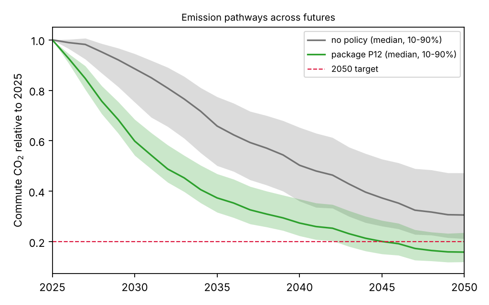
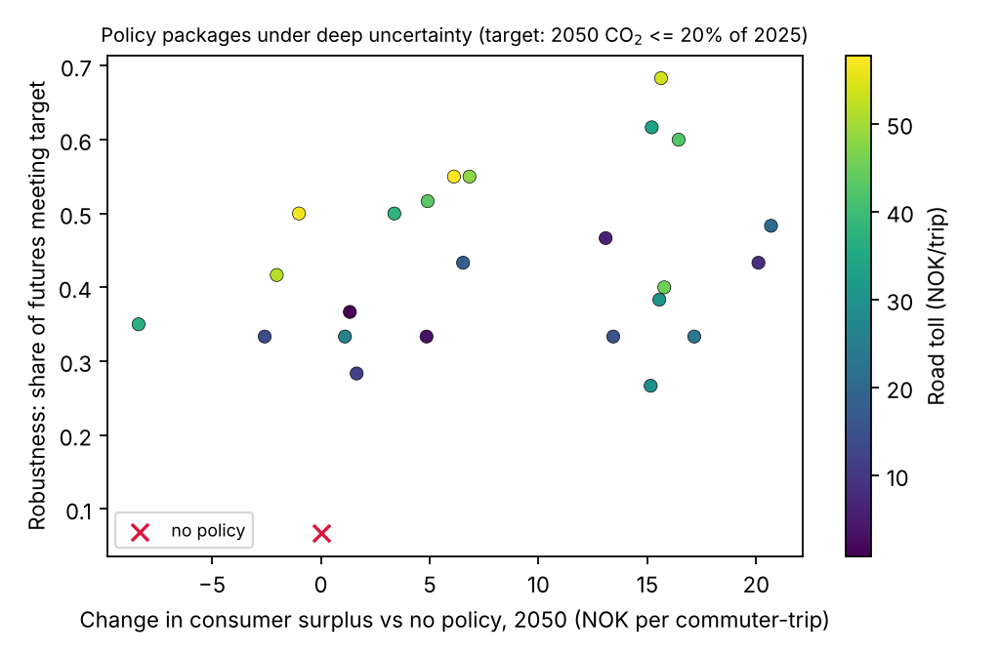
</p>
<p align="center">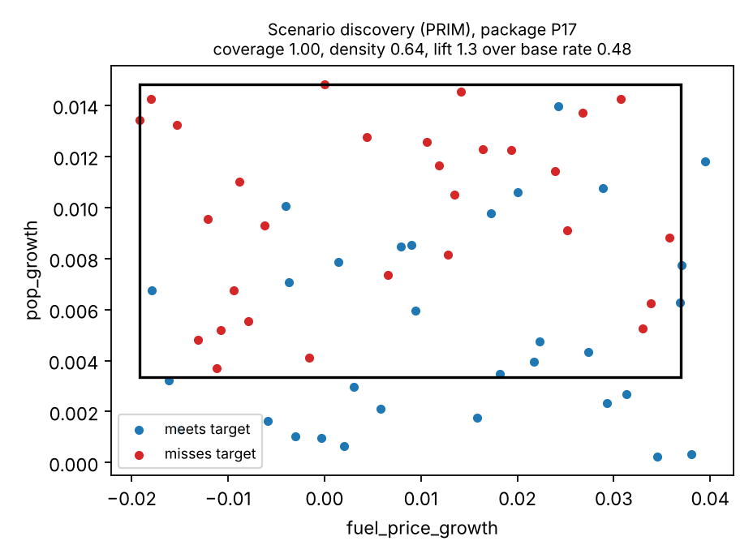</p>

In the sample, no policy meets an 80% cut in commute CO₂ by 2050 in 7% of 60 futures; the most robust
package (pricing, public transport, cycling, EV support) meets it in 68%, and backcasting implies
milestones of about 58% of 2025 emissions by 2030, 36% by 2035 and 26% by 2040.

### Quick start

```bash
pip install -r requirements.txt
python -m pytest tests                      # 79 tests, also run in CI
claude --plugin-dir .                       # use the skills and agents in Claude Code
python servers/hops_app.py                  # then point a Grasshopper Hops component at localhost:5000/cl/vrp
python examples/transplan_study.py          # behaviour -> agents -> futures -> figures
python examples/routing_study.py            # terrain-aware routing and vehicle routing
python skills/viz-story/scripts/story.py    # SimWrapper dashboard, kepler.gl map, Grasshopper tree
```

### Research direction

The framework is built for scenario-based transport planning under deep uncertainty: estimated
behaviour driving agent-based models, explored across futures, with backcasting from 2050 targets.
Suggested reading order for reviewers:

1. [`docs/THEORY.md`](docs/THEORY.md): the theory funnel, what each body of literature gives the thesis.
2. [`docs/FRAMEWORK.md`](docs/FRAMEWORK.md): approaches, the five-layer loop, hybrid agents, research
   flow, PhD alignment and what is still missing.
3. [`docs/research-proposal-outline.md`](docs/research-proposal-outline.md): research questions, four
   articles, data, methods, work plan.
4. [`docs/REFERENCES.md`](docs/REFERENCES.md): papers and repositories behind the tool choices, with
   license status.

Supporting: [`docs/CHECKLIST.md`](docs/CHECKLIST.md) (what to absorb next) and
[`docs/CLAIMS.md`](docs/CLAIMS.md) (how claims are sourced).

### Toolkit limitations

- Demonstration data are synthetic; real data (national travel survey, SSB, NVDB, Entur, Kartverket)
  are the next step.
- The Rhino-side probe and Hops components follow McNeel's SDK and are tested with recorded payloads,
  but have not yet run in a live Rhino session.
- Environmental analysis and Grasshopper optimisation links are planned, not built. The Grasshopper
  pathway explorer and the SimWrapper dashboard are tested by their data contracts, not yet opened in
  Rhino or SimWrapper.
- Tier 2 and tier 3 agents (decision models, LLM agents) are cloned and placed in the design; the
  benchmark harness that tests them against the estimated logit is proposed, not yet built.

## Repository map

```
skills/            Claude Code skills (SKILL.md + scripts/ each)
agents/            Claude Code agents
servers/           MCP server and Grasshopper Hops app over a shared core
examples/          end-to-end studies
data/synthetic/    synthetic test network and generator
docs/              system diagram (Archify), toolchain figure, sample results, proposal outline, checklist, claims policy
tests/             pytest suite (run in CI)
tools/             knowledge-bank tooling: sync, harvest, assemble
knowledge-bank/    third-party open-source references and books, with licenses
```

## License

MIT, © 2026 Arshad Akhtar Abbasia, for the original work in this repository. Third-party material
under `knowledge-bank/` keeps its own license.

## Credits

- Biogeme (Bierlaire), EMA Workbench (Kwakkel), OSMnx (Boeing), NetworkX, PyVRP, Google OR-Tools, Pyomo,
  HiGHS; Gurobi and IBM CPLEX free editions; MCP Python SDK; McNeel's ghhops-server and rhino3dm.
- Grasshopper data-tree rules checked against Rajaa Issa, *Essential Algorithms and Data Structures for
  Computational Design in Grasshopper*, 2nd ed., McNeel 2024 (CC BY-SA 3.0 US).
- Skill-plugin structure and the design toolkit above after Abhinav Bhardwaj's open AEC skill collections (MIT).
- Third-party code under `knowledge-bank/vendor/` keeps its own licenses: [`ATTRIBUTION.md`](knowledge-bank/ATTRIBUTION.md).
- Built with [Claude Code](https://claude.com/claude-code) as a coding assistant.
