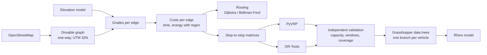

# Computational Logistics

**Terrain-aware routing and delivery planning for small coastal cities, with an AI-agent toolchain
for Rhino and Grasshopper.**

**Author:** [Your Name] · Research portfolio for doctoral application · Case sites: Molde and Kristiansund, Norway

---

## Abstract

Urban logistics models usually treat a city as flat and its streets as interchangeable. In Norwegian
coastal towns neither holds: steep terrain, one-way centres and fjord crossings change which route is
fastest, which is cheapest in energy, and how many vehicles a delivery round needs. With electric vans,
the gap between the *fastest* and the *least-energy* route becomes a planning variable, not a rounding
error.

This repository develops an open, reproducible pipeline that (1) builds a terrain-aware road network
from OpenStreetMap and elevation data, (2) prices every street segment in time and in vehicle energy,
including regeneration downhill, (3) solves delivery routing with capacities and time windows on those
costs, cross-checked by two independent solvers, and (4) brings the results into Rhino/Grasshopper, the
design environment where architects and urban designers work, through Claude Code skills and agents.

A first result on synthetic terrain shows why it matters: on a 60 m hill, the least-energy route uses
**48% less energy** than the fastest route for **25% more driving time** over the same distance.

## Research questions

1. **Terrain and energy.** How much do grade-aware energy costs change route choice, fleet size and
   delivery schedules in hilly coastal towns, compared with time- or distance-based planning?
2. **Method.** Can least-energy routing with regeneration (negative edge costs) be combined with
   state-of-the-art VRP solvers without losing correctness, and how sensitive are plans to vehicle and
   terrain assumptions?
3. **Design practice.** Can AI agents working inside Rhino/Grasshopper make network analysis usable by
   designers, in particular by automating the data-tree handling where most parametric definitions fail?

## What is in this repository

| Part | What it does | Status |
|---|---|---|
| [`skills/osm-network`](skills/osm-network/SKILL.md) | OSM to drivable graph (one-way rules, UTM), DEM grades, travel time, EV energy with regeneration, least-energy routing (Bellman-Ford) | Built, tested |
| [`skills/vrp-solve`](skills/vrp-solve/SKILL.md) | Delivery routing with capacity, time windows, service times on road-network costs; PyVRP and OR-Tools cross-check; solver-independent validation | Built, tested |
| [`skills/gh-datatree`](skills/gh-datatree/SKILL.md) | Tested model of Grasshopper data-tree semantics, live probe for Rhino 8, diagnoser that names the bug and the smallest fix | Model and diagnoser tested; Rhino probe not yet run in Rhino |
| [`agents/gh-datatree-debugger`](agents/gh-datatree-debugger.md) | Claude Code agent: probe, diagnose, fix, re-probe | Built |
| [`skills/cl-foundations`](skills/cl-foundations/SKILL.md) | Router and shared conventions (units, CRS, assumptions to report) | Built |
| [`knowledge-bank/`](knowledge-bank/README.md) | Curated, license-checked collection of third-party open-source skills, solvers, routing engines and MCP servers, assembled into a searchable catalog | Built (third-party work, credited) |
| Rhino baking, isochrones, fleet scenarios, real Molde DEM | See roadmap | Planned |

## Method



**Energy model.** Per edge, traction force = rolling resistance + grade + aerodynamic drag at constant
speed. Positive work is divided by drivetrain efficiency; negative work is recovered at a regeneration
efficiency below 1. Because downhill edges are negative, least-energy paths are found with Bellman-Ford;
regeneration below 100% rules out negative cycles, and the code fails loudly if bad data creates one.

**Routing.** Stops are snapped to the network; all stop-to-stop costs come from shortest paths on the
chosen objective. PyVRP (hybrid genetic search) and OR-Tools (guided local search) solve the same
instance; every plan is then re-evaluated from the true cost matrices by code independent of both solvers.

**Data trees.** Grasshopper pairs component inputs by branch order, repeats the last branch of shorter
inputs and hides graft/flatten/simplify flags behind small icons, which makes structure errors the most
common failure in parametric definitions. `gh-datatree` models these rules in plain Python (testable
without Rhino), reads live trees from a running definition, and reports the cause and the smallest fix.

## First results (synthetic, reproducible)

Synthetic 7 x 7 street grid at Molde harbour (49 nodes, 150 directed edges, one one-way street, one
footway excluded) with a 60 m Gaussian hill. 3.5 t electric van; default urban speeds. Not real
terrain: this checks the method, it is not a finding about Molde.

| Route objective | Length | Time | Energy | Climb |
|---|---|---|---|---|
| Fastest | 2,393 m | 229 s | 0.659 kWh | 59.8 m |
| Least energy | 2,392 m | 287 s | **0.342 kWh** | 6.0 m |

The fastest route takes the higher-speed street over the hill; the least-energy route goes around it.

Delivery round, 8 clients with time windows, 3 vans of capacity 8: PyVRP and OR-Tools find the same plan,
1,120 s total driving, all windows met, no capacity violations.

Reproduce: `python examples/showcase.py`.

## Validation

`python -m pytest tests` runs 38 tests, including:
- energy per edge against a hand calculation; uphill cost exceeds downhill recovery;
- least-energy routes against an independent Bellman-Ford over reachable targets on a 120 m hill;
- VRP: both solvers feasible and agreeing; a 5-stop case equal to brute-force enumeration of all routes;
  time-window violations reported, never hidden;
- data trees: flatten, graft, simplify, trim, shift, flip, path-mapper masks, pairing by branch order,
  graft-against-flat-list cross products; the diagnoser on a recorded faulty definition;
- skill and agent files well-formed, router targets existing.

## Reproduce

```bash
pip install -r requirements.txt
python -m pytest tests
python examples/showcase.py
python skills/vrp-solve/scripts/vrp_solve.py --osm grid_molde.osm \
       --problem skills/vrp-solve/examples/deliveries.json --solver both
```
With Claude Code, load the repository as a plugin: `claude --plugin-dir .` The router skill
`cl-foundations` dispatches to the others.

## Limitations

- Results so far are on synthetic terrain. Real DEMs drape bridges and tunnels over the ground and need
  checking edge by edge.
- Vehicle parameters and default speeds are assumptions; they must be calibrated with operator data.
- Energy is constant-speed traction: no acceleration, stops, payload changes or cabin heating, so real
  consumption is higher, especially in winter.
- Energy objectives in the VRP use a constant shift per leg to keep costs non-negative, which slightly
  favours fewer vehicles; reported energy is always unshifted.
- The Rhino-side probe follows the Grasshopper SDK but has not yet been run in a live Rhino session.

## Roadmap

1. Real case: Molde and Kristiansund networks with the Norwegian national elevation model.
2. Ferry and bridge edges, and winter speed and energy profiles.
3. Fleet scenarios: diesel vs electric, depot location, charging, sensitivity analysis.
4. Accessibility and isochrones for services across the two towns.
5. Rhino/Grasshopper integration through Rhino MCP: baking routes, live probing of data trees.

## Repository map

```
skills/            Claude Code skills (each: SKILL.md, scripts/, examples/ or reference/)
agents/            Claude Code agents
tests/             pytest suite
examples/          showcase script reproducing the results above
grid_molde.osm     synthetic test network
knowledge-bank/    third-party open-source collection, catalog and tooling (see its README)
tools/             knowledge-bank tooling: sync, harvest, assemble
```

## Credits

- Open-source engines: [OSMnx](https://github.com/gboeing/osmnx) (Boeing), [PyVRP](https://github.com/PyVRP/PyVRP)
  (Wouda, Lan, Kool), [Google OR-Tools](https://github.com/google/or-tools), [NetworkX](https://networkx.org).
- The skill-plugin structure (foundation router, specialist skills, calculators) follows the open AEC
  skill collections by [Abhinav Bhardwaj](https://github.com/Abhinavbwj) (MIT).
- Everything under `knowledge-bank/vendor/` is third-party work kept under its own license; see
  [`knowledge-bank/ATTRIBUTION.md`](knowledge-bank/ATTRIBUTION.md).
- Built with [Claude Code](https://claude.com/claude-code) as a coding assistant.
